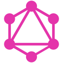
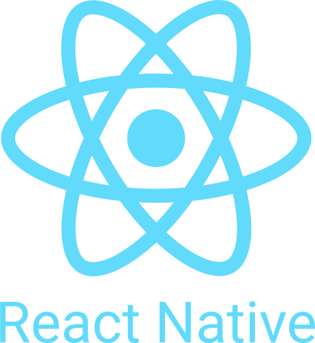

<h1 align="center">Hi 👋, I'm Dhaou yahya</h1>
<h3 align="center" style>A passionate Full-Stack developer , React Specialist</h3>

  
  &nbsp;&nbsp;&nbsp;
  
  &nbsp;&nbsp;&nbsp;
  

<!--  -->

---

 

- 🔭 I’m currently looking for new challenges.

- 🌱 I’m currently learning Python .

- 📫 How to reach me **yahya.dhaou75@gmail.com**

