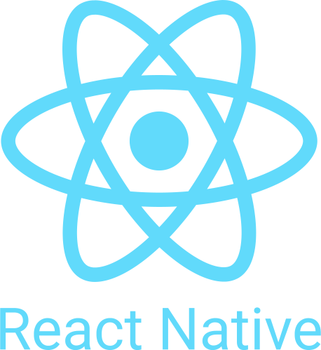

<h1 align="center">Hi 👋, I'm Dhaou yahya</h1>
<h3 align="center" style>A passionate Full-Stack developer from Tunisia</h3>

---

 

- 🔭 I’m currently working on Some Projects .

- 🌱 I’m currently learning Python .

<!-- -  I’m looking to collaborate on Youtube . -->

- 📫 How to reach me **yahya.dhaou75@gmail.com**

<!--  -->

<!--  -->

<!--  -->
<!--  -->

<!--  -->

<!--  -->
<!--  -->

<!--  -->

- Top languages

